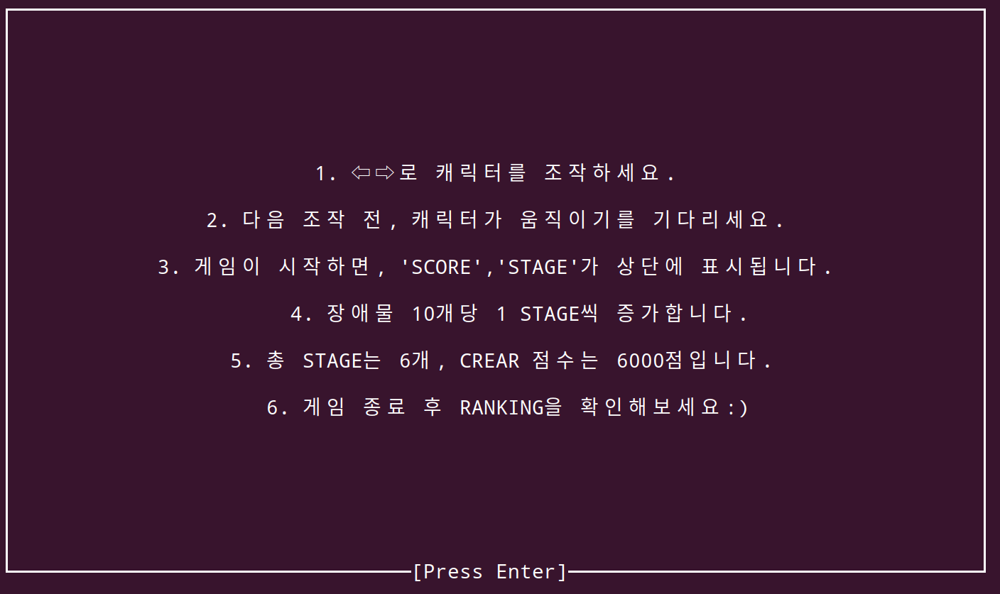
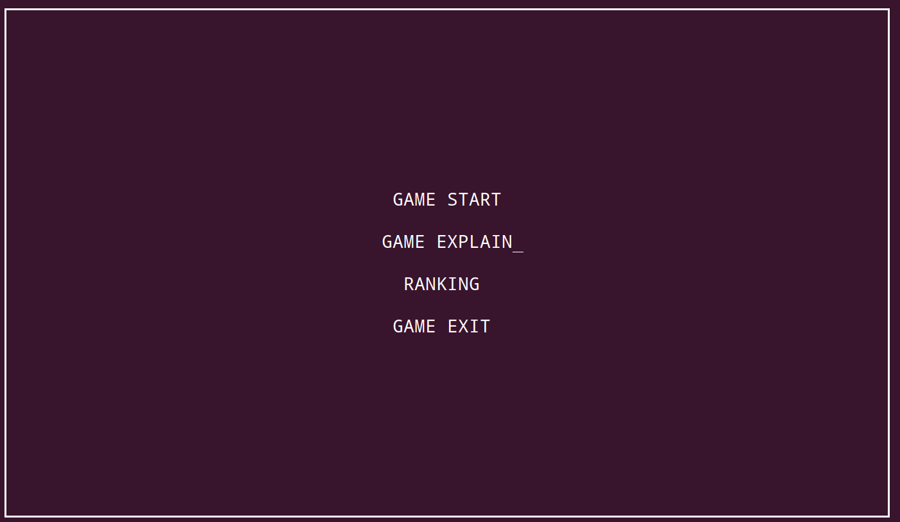
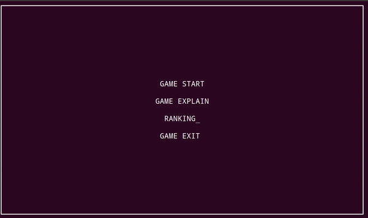

# 장애물 피하기게임 

# 설치 방법
1. 패키지 다운로드 
ncurses.h 헤더파일을 이용했습니다. 
컴파일 전에 아래의 명령어를 통해 패키지를 다운로드 받으세요 

 sudo apt-get update 
 sudo apt-get install libncurses5-dev libncursesw5-dev 

2. 컴파일  
git clone을 이용하여 저장소를 다운로드합니다.  
다운로드 받은 저장소에서 make 명령어를 통해 컴파일합니다.  
./game명령어를 통해 프로그램을 실행합니다.   

# 게임 설명

# 게임 시작 화면

# 게임 플레이 예시 영상

